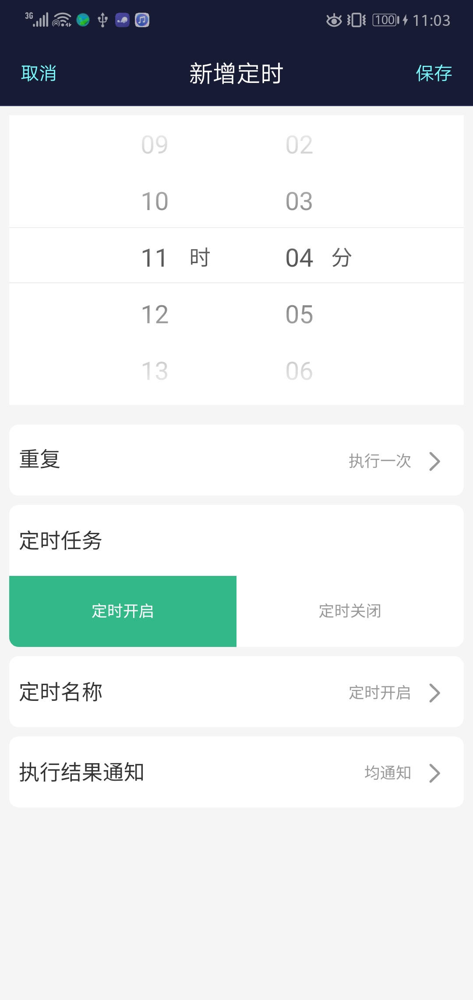
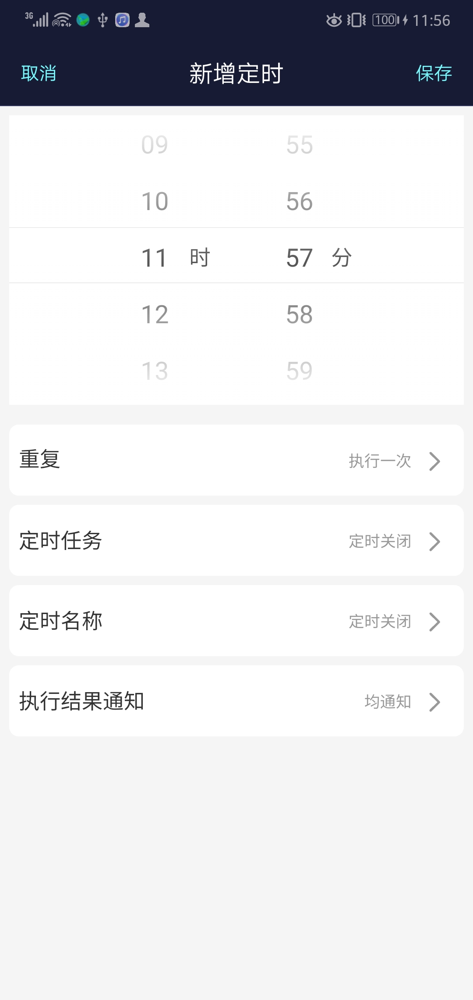

# JD-Timer

## 1、入口

根据京东UI规范、定时入口设在 panel/app.js , 同时也带有最后一条定时desc （xx小时xx分钟后 开启/关闭电源）

案例代码 panel/app.js :
```javascript
import higherOrderLastTimer from '../components/jd/CloudTimer/LastTimerCountdown';
import FunctionBlock from '../components/jd/FunctionBlock'

const JdTimerCountdown=higherOrderLastTimer(({onClick, lastTimer}) => {
    const {task_status, task_name, showCountdown, showTime, cmdDesc } = lastTimer;
    // showCountdown:最近一条定时的倒计时类型，下一次执行还剩多少分钟 （HH小时mm分钟后 开启电源））
    // showTime: 最近一条定时的时间点类型，下一次执行具体的时间（YYYY年MM月DD日 HH:mm 开启电源）
    // cmdDesc：定时的命令描述 而不是显示定时名称task_name，默认定时名称task_name
    return (
        <FunctionBlock className={style.functionBlockMarginB}>
            <div className={style.functionText}>定时设置 <span className={style.setBlock} onClick={onClick}>设置</span>
            </div>
            <div className={style.timerTask}>
                {task_status &&<span className={style.timerText}> {showCountdown}</span> }
                <span className={style.taskName}>{task_name? " 执行定时 - "+task_name : "今日无定时设置"}</span>
            </div>
        </FunctionBlock>
    )
})

//render    ready一定要传
<JdTimerCountdown ready={this.props.isReady}  onClick={()=> this.props.history.push('/timer')} desc={this.props.desc}/>

```

## 2、定时命令设置

定义在panel/index.js, 2种类型
案例代码 panel/app.js :

```javascript
import Timer from '../components/jd/CloudTimer';
const cmdIsPage = true  // Cmdpage  1、true:定时cmd命令设置在单独路由 timer/setting  2、cmd命令设置在定时详情界面 timer/detail
const jdTimerSetting=({ cmd, updateCmd }) =>{
    return(
        <div className= {classNames({[style.jdOperaBox]:true,[style.jdOperaBox_noMargin]:!cmdIsPage})}>
            {cmdIsPage && <div className={style.cmdTitle}>定时任务 </div> }
            <div className={style.cmdFatherBox}>
                <div className={classNames({[style.cmdChildBox]:true,[style.select]:cmd && cmd.Power === 1})} onClick={()=>updateCmd({Power:1})}>
                    定时开启
                </div>
                <div className={classNames({[style.cmdChildBox]:true,[style.select]:cmd && cmd.Power === 0})}onClick={()=>updateCmd({Power:0})}>
                    定时关闭
                </div>
            </div>
        </div>
    )
}

desc = cmd => {
    const {formatMessage}=this.props.intl;
    const cmdName=function (message) {
        return formatMessage({id:message})
    }
    return cmd? (cmd.Power === 1 ? cmdName('cmdON'):cmdName('cmdOFF')):cmdName('cmdUnknown');
};
//render
<Route path="/timer" render={ props =>
    <Timer {...props} desc={this.desc} setting={jdTimerSetting} cmdIsPage={cmdIsPage}/>
}/>
```

less

```less
.jdOperaBox{
    margin: 0.2rem 0.2rem 0 0.2rem;
    border-radius: 0.2rem;
    background: #fff;
    overflow: hidden;
    .cmdTitle{
        .px2px(font-size, 32px);
        color: #000;
        height: 1.5rem;
        line-height: 1.5rem;
        padding-left: 0.2rem;
    }
    .cmdFatherBox{
        display: flex;   
        .cmdChildBox{
            color: #999999;
            flex:1;
            text-align: center;
            height: 1.5rem;
            line-height: 1.5rem;
        }
    }
    .select{
        background: @theme-color !important;
        color: #fff !important;
    }
}
.jdOperaBox_noMargin{
    margin: 0;
    border-radius: 0 !important;
}
```

+ ### timerDetail界面,定义cmdIsPage为false




+ ### timerSetting界面,定义cmdIsPage为true,命令设置为单独的界面  

  
 =>

