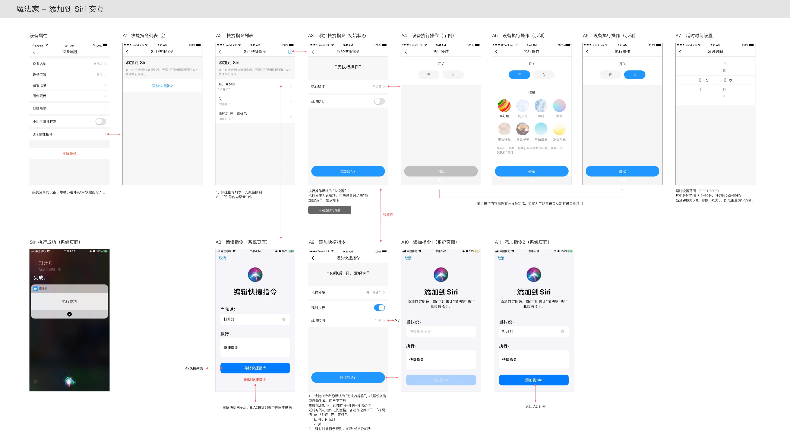

# siri

ios sir快捷指令功能，通过设置siri指令来语音控制设备，已兼容魔法家app、耐思app、统一app。  
app通过读取h5包zh-cn的voiceful.html文件来添加siri指令，在设备属性页点击“Add to Siri”来进入voiceful.html

# 说明

需要在`package.js`中吧**supportSiri**设置为`true`  
使用方法与sdkTimer类似，需开发一个 ‘Setting组件’ 以及 ‘desc函数’ 。
> 只在dna平台时有效

# 经典交互

